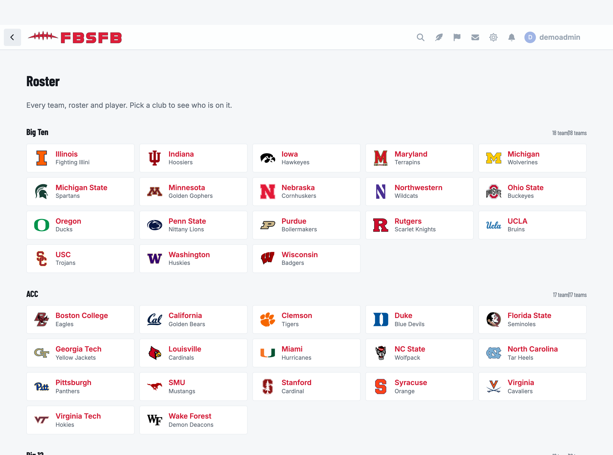
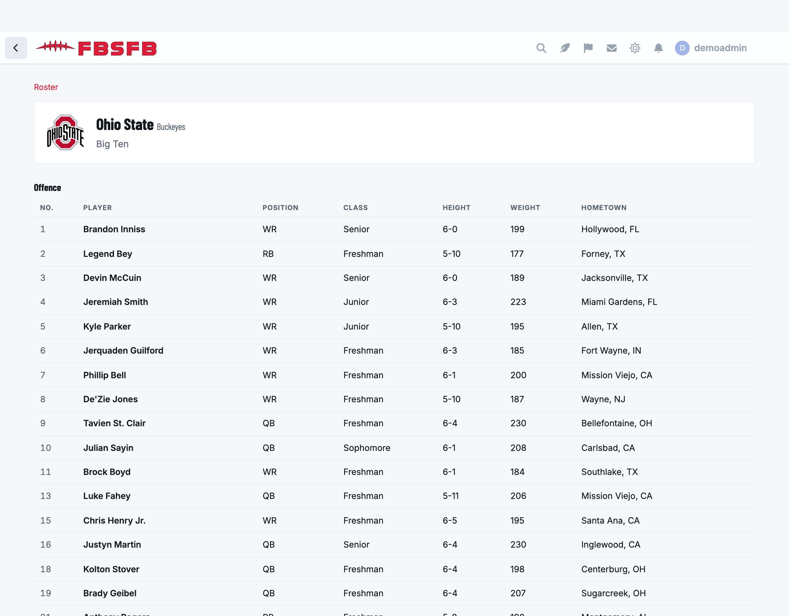

# Roster

Every team, roster and player, for [Flarum](https://flarum.org) 2.

Browse by conference or division, open a club, and see who is on it.



A club's roster, grouped the way the sport groups it:



## Which leagues

| League | Source | What you get |
|---|---|---|
| College football | CollegeFootballData | Rosters with class years |
| NFL, NBA, MLB, NHL, MLS, Premier League, WNBA | ESPN | The current roster, with position, number, size and hometown |

College football is always on. The rest are tick boxes in **Admin → Roster**,
and they cost nothing: ESPN needs no API key.

```sh
composer require ernestdefoe/roster
php flarum migrate
php flarum cache:clear
```

`roster:sync` runs hourly on Flarum's scheduler and needs nothing else.

## Things worth knowing

🚨 **The position groups are the provider's own.** Offence, defence and
specialists is a fact about gridiron; ESPN answers Pitchers and Catchers,
Centers and Wingers. Mapping a shortstop through a list of football positions
returns "other" for every player on the team, so the group is stored as it was
given and only gridiron's four are translated.

🚨 **A professional club has no class column.** There is no such thing as a
sophomore in the NBA, and an empty column under a heading that means nothing in
the sport reads as missing data rather than as a concept the sport lacks.

🚨 **A box score is one call per club on ESPN**, so the sync is capped at a
dozen rosters a run and works oldest-first. A club whose roster is a day old is
invisible; a queue worker killed by its own traffic is not.

🚨 **A club with an empty roster is still stamped as fetched.** ESPN assembles
that endpoint from its own upstream calls, and one athlete with a missing record
takes a whole club's roster down with a 404 — seen live on one NFL club while
the other thirty-one answered. Without the stamp that club is retried first on
every run for ever, and no other club is ever reached.

## Requires

- Flarum 2

## Licence

MIT.
